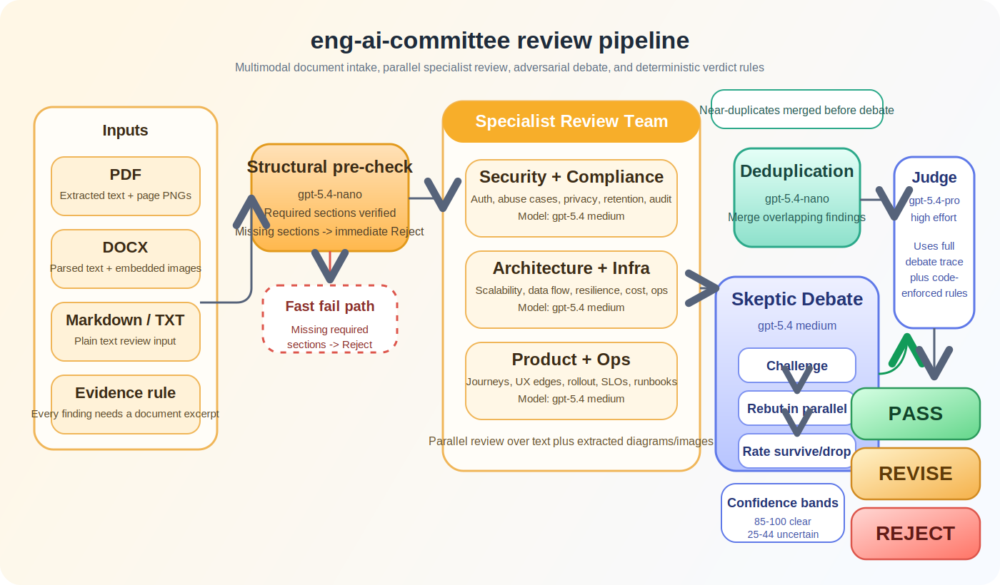

# eng-ai-committee

A multi-agent quality gate for engineering design docs. Three specialist agents review in parallel, an adversarial skeptic challenges weak findings, and a judge produces a **Pass / Revise / Reject** verdict. Available as a CLI tool and as a pixel-art web UI with real-time agent animations.

---

## How it works



```
Doc → Structural pre-check
    → 3 specialist agents in parallel
    → Deduplication
    → Skeptic debate (challenge → rebut → rate)
    → Judge verdict
```

### 1. Structural pre-check

`gpt-5.4-nano` verifies the document has the required sections before any deep review starts. Missing required sections → automatic **Reject** without spending tokens on specialist review.

### 2. Specialist agents (parallel)

Three agents run in parallel with `gpt-5.4` at `medium` reasoning effort, each covering multiple subdomains:

| Agent | Subdomains |
|---|---|
| `security-compliance` | Auth/authz gaps, data exposure, injection vectors, secrets management, session management, SSRF/CSRF/abuse cases · GDPR, SOC2, CCPA/CPRA, HIPAA, PII retention, consent, audit trails, cross-border data transfer |
| `architecture-infra` | System design coherence, data flow correctness, anti-patterns, coupling · Redundancy, failover, horizontal scaling, DB bottlenecks, caching stampedes, queue backpressure, thundering herd, RTO/RPO runbooks · Cloud cost estimates, over-engineering, build-vs-buy, licensing |
| `product-ops` | User journeys, edge cases, error UX, empty states, accessibility, API ergonomics · Deployment strategy, rollback plans, feature flags, SLIs/SLOs, alerting, runbook completeness, on-call escalation, untested failure modes |

Each finding requires a verbatim `excerpt` from the document — no findings without textual evidence.

**Multimodal review**: when a PDF is uploaded, each page is rendered as a PNG image (at 1.5× scale, up to 20 pages) and passed to all three specialist agents alongside the extracted text. Architecture diagrams, flowcharts, and other graphics are fully visible to the agents — not just the text around them.

### 3. Deduplication

`gpt-5.4-nano` merges near-duplicate findings across agents before debate begins.

### 4. Skeptic debate

The skeptic (`gpt-5.4`, `medium`) challenges every Medium/High/Critical finding using one of five attack vectors:

| Attack vector | What it tests |
|---|---|
| **EXCERPT VALIDITY** | Does the quoted text actually demonstrate the claimed problem? |
| **SEVERITY INFLATION** | Is severity proportional to realistic probability × blast radius? |
| **SPECIFICITY** | Is this a generic suggestion, or specific to a gap in this design? |
| **ALREADY ADDRESSED** | Does the document handle this elsewhere? |
| **STRAW MAN** | Is the finding attacking a design choice the document doesn't propose? |

Challenge intensity scales with severity — Critical/High findings are challenged hard (demanding a precise failure path and blast radius), Medium findings are pressed on specificity and actionability, Low findings get a focused excerpt check.

**Specialists rebut in parallel.** Each rebuttal must identify the attack vector used and respond to it directly — not restate the original finding.

**Skeptic rates each rebuttal** with severity-proportional criteria:
- Critical/High: must name the specific failure path, realistic probability, and blast radius
- Medium: must show the finding is actionable and specific to this design (not generic advice)
- Low: must confirm the excerpt supports the claim

Findings rated **unconvincing** are dropped. Findings rated **convincing** survive to the judge.

### 5. Judge verdict

`gpt-5.4-pro` at `high` effort receives the full debate trace (all findings, challenges, rebuttals, and ratings) and produces a final verdict:

**Verdict rules** (enforced in code, not just by the LLM):

| Condition | Verdict |
|---|---|
| Missing required sections | Reject |
| 2+ Critical survived debate | Reject |
| 1+ Critical or 2+ High survived | Revise |
| 1 High survived | Revise |
| 0 High/Critical, ≤2 Medium survived | Pass |

**Confidence calibration** uses numeric bands:
- **85–100**: All surviving findings convincingly defended; verdict is unambiguous
- **65–84**: Most findings convincing; one borderline call or close threshold
- **45–64**: Mixed debate quality; several unconvincing ratings kept findings alive
- **25–44**: Significant uncertainty — weak rebuttals or incomplete inputs

Anti-bias rules prevent the judge from softening a verdict because the document is well-written, or inflating confidence because the debate was clean.

The judge produces a **revision memo** (Revise/Reject) with blocking issues listed by severity — each with what is missing, why it matters, and what a sufficient fix looks like. For Pass, it produces a **committee brief** summarizing what the system does and why it passed.

---

## Requirements

- Node.js 22.5+ (uses built-in `node:sqlite`)
- OpenAI API key with access to `gpt-5.4` and `gpt-5.4-pro`

---

## Setup

```bash
git clone <your-repo-url>
cd eng-ai-committee
npm install
npm run build

export OPENAI_API_KEY=<your-openai-api-key>
```

---

## Web UI

A pixel/minecraft-style meeting room that visualises the review pipeline in real time. Agents sit around a table, think, debate, and the judge delivers a verdict with an animated banner.

```bash
# Build the frontend and start the server
npm run web:build
npm run web:start            # production, port 3000

# Or run in dev mode (no separate build step needed)
npm run web:dev              # hot-reloads server, serves built client
```

Open **http://localhost:3000**.

### Web UI features

- **Upload** PDF, DOCX, Markdown, or TXT — images and diagrams are extracted and sent to agents automatically
- **Live editor** — edit the doc in CodeMirror before or after review
- **Real-time room** — watch each agent's thinking bubbles, speech bubbles, debate lines, and judge verdict animate as the pipeline runs
- **Full Review Report** — filterable findings modal with agent and severity filters; shows debate outcome for each finding
- **Export Doc** — download the design document as DOCX or PDF with embedded images
- **Export Report** — download the full agent findings report (all findings, debate outcomes, verdict) as DOCX or PDF
- **Post-review chat** — talk to the judge, ask it to suggest specific text edits, apply suggestions directly into the editor
- **Review history** — past reviews saved to SQLite; click any history entry to instantly restore the full page state (editor, report, verdict banner, all agent findings)
- **Session recovery** — if you refresh mid-review, the page reconnects to the running pipeline and replays all events
- **Live log tab** — real-time pipeline event log in the right panel; auto-opens when a review starts
- **Conversation log** — full timeline of every pipeline event and chat message for any run

### Web UI environment variables

| Variable | Default | Description |
|---|---|---|
| `OPENAI_API_KEY` | required | OpenAI API key |
| `PORT` | `3000` | HTTP port |
| `DB_PATH` | `./data/reviews.db` | SQLite database path |

---

## CLI usage

```bash
# Full review (all 3 agent groups)
npx tsx src/cli.ts path/to/design-doc.md

# Resume after a crash
npx tsx src/cli.ts path/to/design-doc.md

# Start over, ignoring any saved checkpoint
npx tsx src/cli.ts path/to/design-doc.md --reset

# Two debate rounds (more thorough; same as "Debate Rounds: 2" in the web UI)
npx tsx src/cli.ts path/to/design-doc.md --depth 2

# Run a single agent group (faster, cheaper)
npx tsx src/cli.ts path/to/design-doc.md --agents security-compliance
npx tsx src/cli.ts path/to/design-doc.md --agents security-compliance,architecture-infra

# Machine-readable JSON output
npx tsx src/cli.ts path/to/design-doc.md --json
```

### Supported input formats

| Format | Text | Images / diagrams |
|--------|------|-------------------|
| `.md` / `.mdx` / `.markdown` | Markdown rendered to plain text | Embedded base64 images extracted |
| `.pdf` | Text extracted from all pages | Every page rendered as PNG and sent to agents |
| `.docx` | Parsed via mammoth | Embedded images extracted and sent to agents |
| `.txt` and other text | Read as UTF-8 | — |

---

## CLI output

```
╔════════════════════════════════════╗
║  VERDICT: REVISE  (72% confidence) ║
╚════════════════════════════════════╝

BLOCKING ISSUES (3):
  [HIGH] No rate limiting on public API endpoints
    "The /search endpoint accepts unlimited requests..."
    Fix: Add API gateway rate limiting before launch

  [HIGH] Missing rollback plan for DB migration
    "We will run ALTER TABLE on the users table..."
    Fix: Add a rollback script and test it in staging first

DEBATE SUMMARY:
  14 raw findings → 12 challenged → 3 survived
  security-compliance: 4 → 1 survived
  architecture-infra:  6 → 1 survived
  product-ops:         4 → 1 survived
```

---

## Exit codes (CI-friendly)

| Code | Meaning |
|------|---------|
| `0` | Pass |
| `1` | Revise |
| `2` | Reject |
| `3` | Pipeline error |

```yaml
# Example GitHub Actions step
- name: Review design doc
  run: npx tsx src/cli.ts docs/design.md
  env:
    OPENAI_API_KEY: ${{ secrets.OPENAI_API_KEY }}
```

---

## Models

| Role | Model | Reasoning effort |
|---|---|---|
| Specialist review | `gpt-5.4` | `medium` |
| Skeptic challenges + ratings | `gpt-5.4` | `medium` |
| Specialist rebuttals | `gpt-5.4` | `medium` |
| Judge | `gpt-5.4-pro` | `high` |
| Dedup + Structural check | `gpt-5.4-nano` | `low` |

To change models, edit `src/config.ts`:

```ts
const DEFAULT_CONFIG = {
  specialistModel: 'gpt-5.4',
  judgeModel:      'gpt-5.4-pro',
  skepticModel:    'gpt-5.4',
  dedupModel:      'gpt-5.4-nano',
};
```

---

## Pipeline reliability

**Checkpoint / resume**: state is saved after each stage to a `.checkpoint.json` file. If the pipeline crashes, re-running the same command resumes from the last completed stage — no wasted API calls.

**Specialist retry**: each specialist is retried once on failure (10-minute timeout per attempt). If both attempts fail, the pipeline exits with an error rather than returning a partial verdict.

**Debate resilience**: if a single rebuttal times out, it is skipped rather than failing the whole round. The finding is dropped (not defended = unconvincing by default).

**Judge fallback**: if the judge times out after both attempts, a deterministic fallback verdict is produced from the surviving findings using the verdict table rules — the pipeline always completes.

---

## K8s deployment

Kubernetes manifests are in `k8s/`. The app runs as a single replica (SQLite does not support concurrent multi-writer across pods).

```bash
# Build and push image
docker build -t eng-ai-committee .
docker tag eng-ai-committee <your-registry>/eng-ai-committee:latest
docker push <your-registry>/eng-ai-committee:latest

# Deploy
kubectl apply -f k8s/
```

Configure ingress/load balancer and the `OPENAI_API_KEY` secret for your own cluster/environment (see `k8s/deployment.yaml`).

To scale beyond one replica, migrate the database from SQLite to PostgreSQL.

---

## Development

```bash
npm install

# Run tests
npm test

# Type-check everything
npx tsc --noEmit
npx tsc -p tsconfig.server.json --noEmit

# Build
npm run build          # pipeline TypeScript → dist/
npm run web:build      # server TypeScript + Vite client → dist/server + dist/client
```

Tests live in `src/pipeline/__tests__/` and use Vitest with all LLM calls mocked.

---

## Quick test

```bash
cat > /tmp/test.md << 'EOF'
# Auth Redesign

## Problem Statement
JWT secrets are hardcoded in the repo. Tokens never expire.
No rate limiting on /login.

## Success Criteria
Secrets in env vars. 24h token expiry. /login rate limited.

## Architecture
API gateway with Redis rate limiter in front of /login.
JWT keys from a managed secrets service. Sessions in Postgres.
EOF

npx tsx src/cli.ts /tmp/test.md --agents security-compliance
```
